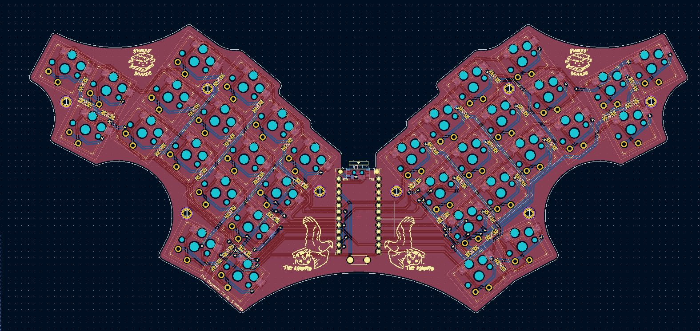

The Osprette V2
===============

The Osprette V2 is a 34-key unsplit keyboard. It has the following features:

- Choc V1 switches
- Optionally hotswap using Kailh choc hotswap sockets
- Bluetooth-capable with a nice!nano controller
- Pinky clusters (top pinky keys on the sides)
- Splay (4° between middle and ring, 8° between ring and pinky)

## How to Order

The [gerber folder](./gerber) has everything you'll need to get this printed.
You'll want to print one of each of the 4 gerber ZIP's where the switch plates
and the bottom plate are 1.2mm thick and the main PCB is 1.6mm thick. You can
order from [JLC](https://jlcpcb.com) by just uploading each archive and keeping
the default options asides from the thickness. I'd suggest removing the order number,
otherwise they'll put one on the board somewhere randomly.

## Parts

Part Name                  | Quantity      | Notes                          | Link
--------------------------:|:-------------:|:------------------------------:|:----
PCB                        | 1             |                                | Look up hurr hurr
Choc V1 Switches           | 34            |                                | <https://mkultra.click/choc-switches>
Choc Keycaps               | 34            |                                | <https://mkultra.click/mbk-factory-colors>
SMD Diodes                 | 34            |                                | <https://www.aliexpress.com/item/3256802562651339.html>
Pro Micro-style Controller | 1             |                                | <https://mkultra.click/nice-nano-v2>
Power Switch               | 1 (optional)  |                                | <https://www.digikey.com/en/products/detail/nidec-copal-electronics/CUS-12TB/1124222>
Reset Switch               | 1 (optional)  |                                | <https://www.aliexpress.us/item/3256804499798985.html>
Small LiPo Battery         | 1 (optional)  |                                | <https://www.aliexpress.us/item/2251832546143327.html>
MCU Sockets                | 1 (optional)  | Chop into sections of 12 pins  | <https://www.digikey.com/en/products/detail/mill-max-manufacturing-corp/316-43-164-41-006000/1212147>
MCU Socket Pins            | 48 (optional) | Buy extras, these are slippery | <https://www.digikey.com/en/products/detail/mill-max-manufacturing-corp/3320-0-00-15-00-00-03-0/4147392>

## Pictures

